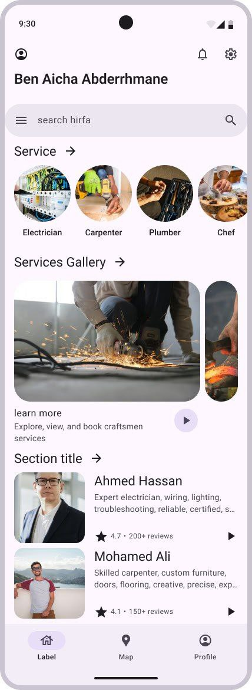

# Task 2: Implement the First UI in view/MainScreen

## Code Explanation

The codebase is structured around Hirfa application using **MVVM Architecture**. Here are the key components:

1. **CraftsmanViewModel**: Handles the business logic for craftsmen.
2. **CategoryViewModel**: Manages the logic for categories.
3. **CraftsmanRepository**: Acts as a repository for craftsmen.
4. **Category & Craftsman Models**: Define the data structure for categories and craftsmen.

## Task

Your task is to implement the first UI in `view/MainScreen` based on the design provided in `FIrstUI.jpg`. The UI should include:

- A list of craftsmen.
- A navigation bar to switch between categories.
- A craftsman detail view when a craftsman is selected.
- A search bar to filter craftsmen by name or category.

### Additional Requirements

1. **Add More Craftsmen and Categories**:
   - Add at least 5 more craftsmen and 2 more categories to the mock data in `CraftsmanRepository.kt` and `CategoryRepository.kt`.
   - Ensure the new craftsmen and categories are displayed in the UI.

2. **Implement Search Functionality**:
   - Add a search bar to the top of the `view/MainScreen` UI.
   - Implement functionality to filter the craftsmen list based on the search query (e.g., by craftsman name or category).

## Instructions

1. Open `view/MainScreen.kt`.
2. Implement the UI layout in `view/MainScreen`.
3. Use the `CraftsmanViewModel` to fetch and display craftsmen.
4. Ensure the UI matches the design in `FIrstUI.jpg`.

## FirstUI

Good luck!
